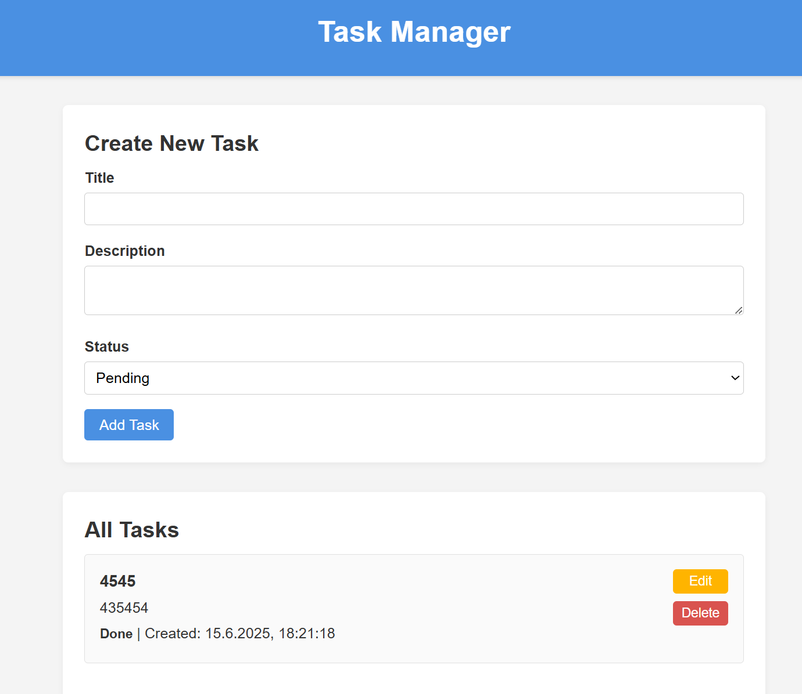

# Task Manager Project

Welcome to your Task Manager project! This repository contains a Node.js/Express backend and a static frontend. You’ll work primarily in the `server/` folder to implement the CRUD API and middleware, while the `client/` folder already contains the UI so you can focus on server-side logic. As you progress through each section, you’ll see placeholder images that illustrate what you should see when the app is running.

---

## Table of Contents

- [Features](#features)  
- [Tech Stack](#tech-stack)  
- [Prerequisites](#prerequisites)  
- [Getting Started](#getting-started)  
- [Running the App](#running-the-app)  
- [API Endpoints](#api-endpoints)  
- [Project Structure](#project-structure)  
- [How It Works](#how-it-works)  
  - [UUID for Unique IDs](#uuid-for-unique-ids)  
  - [Middleware](#middleware)  
  - [Data Persistence](#data-persistence)  
- [Usage & Screenshots](#usage--screenshots)  
  - [1. Initial UI](#1-initial-ui)  
  - [2. Adding a Task](#2-adding-a-task)  
  - [3. Editing a Task](#3-editing-a-task)  
  - [4. Deleting a Task](#4-deleting-a-task)  
- [Troubleshooting](#troubleshooting)  

---

## Features

- Full CRUD operations on “tasks” (Create, Read, Update, Delete)  
- Custom middleware for request logging and payload validation  
- Static frontend that makes `fetch` calls to your API  
- JSON file persistence (`tasks.json`)—no database required  

---

## Tech Stack

- **Backend**: Node.js, Express, `uuid`, built-in `fs.promises`  
- **Frontend**: HTML, CSS, vanilla JavaScript (Fetch API)  
- **Data Storage**: `tasks.json` (simple JSON file)  

---

## Prerequisites

- **Node.js** (v14 or later) and **npm**  
- Git (to clone this repository)  
- A modern browser (Chrome, Firefox, Edge, etc.)  

---

## Getting Started

1. **Clone this repository**  
   ```bash
   git clone https://github.com/<your-username>/task-manager-project.git
   cd task-manager-project
   ```

2. **Install backend dependencies**  
   ```bash
   cd server
   npm install
   ```

3. **(Optional) Return to the project root**  
   ```bash
   cd ..
   ```

> The frontend is already set up in `client/`; there’s no build step needed for that folder.

---

## Running the App

1. **Start the server**  
   In the `server/` folder, run:
   ```bash
   npm start
   ```
   By default, your server will listen on **port 3000**. You should see:
   ```
   Server listening on http://localhost:3000
   ```

2. **Open the UI in your browser**  
   - via VS Code Live Server at `http://127.0.0.1:5500`

---

## API Endpoints

| Method  | Endpoint     | Description                     | Request Body                       | Response                                    |
| ------- | ------------ | ------------------------------- | ---------------------------------- | ------------------------------------------- |
| **POST**   | `/tasks`     | Create a new task               | `{ "title", "description", "status" }` | Newly created task object (JSON)             |
| **GET**    | `/tasks`     | Retrieve all tasks              | —                                  | Array of task objects (JSON)                 |
| **GET**    | `/tasks/:id` | Retrieve one task by ID         | —                                  | Task object (JSON)                           |
| **PUT**    | `/tasks/:id` | Update a task by ID             | `{ "title", "description", "status" }` | Updated task object (JSON)                   |
| **DELETE** | `/tasks/:id` | Delete a task by ID             | —                                  | `{ "message": "Task deleted successfully." }` |

> **Validation rules**:  
> - `title` must be a non-empty string.  
> - `status` must be one of: `pending`, `in-progress`, `done`.  

---

## Project Structure

```
task-manager-project/
├── client/                 ← Static front-end files (HTML, CSS, JS)
│   ├── index.html
│   ├── styles/
│   │   └── styles.css
│   ├── js/
│   │   └── script.js
│   └── images/             ← (placeholder for your screenshots)
└── server/                 ← Server-side logic (where you’ll code)
    ├── index.js            ← Express app with CRUD routes
    ├── logger.js           ← Logs every incoming request
    ├── validateTask.js     ← Validates POST/PUT request payloads
    ├── errorHandler.js     ← Catches uncaught errors (500 responses)
    ├── tasks.json          ← Task storage (starts as `[]`)
    └── package.json        ← Lists dependencies (`express`, `uuid`)
```

You will only need to modify `server/index.js` file. 
The `client/` folder and the other files in `server/` are ready to use.

---

## How It Works

### UUID for Unique IDs

We use the [`uuid`](https://www.npmjs.com/package/uuid) package to generate random unique IDs for each task. Simply call `uuidv4()` whenever you need a new ID. For example, in the `POST /tasks` route:
```js
const { v4: uuidv4 } = require('uuid');

const newTask = {
  id: uuidv4(),             // random unique string
  title: req.body.title.trim(),
  description: req.body.description ? req.body.description.trim() : '',
  status: req.body.status,
  createdAt: new Date().toISOString(),
  updatedAt: new Date().toISOString(),
};
```
That ID ensures each task can be reliably found, updated, or deleted.

---

### Middleware

- **Logger** (`server/logger.js`)  
  Logs each HTTP request in the console, for example:  
  ```
  [2025-06-03T14:22:10.123Z] GET /tasks
  ```
- **Validation** (`server/validateTask.js`)  
  Runs on `POST /tasks` and `PUT /tasks/:id` to check that:
  - `title` is a non-empty string  
  - `status` is one of `pending`, `in-progress`, `done`  
  Returns `400 Bad Request` if the payload is invalid.

- **Error Handler** (`server/errorHandler.js`)  
  Captures any uncaught errors (e.g., file I/O failures) and responds with:
  ```json
  { "error": "Something went wrong on the server." }
  ```

---

### Data Persistence

- All tasks live in the `server/tasks.json` file as a JSON array.
- In `index.js`, two helper functions manage reading and writing:
  ```js
  async function readTasks() {
    try {
      const data = await fs.readFile(DATA_PATH, 'utf-8');
      return JSON.parse(data);
    } catch {
      // If file is missing or JSON is invalid, return an empty array
      return [];
    }
  }

  async function writeTasks(tasksArray) {
    await fs.writeFile(DATA_PATH, JSON.stringify(tasksArray, null, 2));
  }
  ```
- Each CRUD route calls `readTasks()`, updates the array in memory, then calls `writeTasks()` to overwrite `tasks.json`.

---

## Usage & Screenshots

Below are the stages you should see when the app is running. Replace each `` link with an actual screenshot after you run the app.

### 1. Initial UI

When you first navigate to `http://localhost:3000`, you’ll see this page:


- A form at the top for creating a new task  
- An empty list below (because `tasks.json` starts empty)

---

### 2. Adding a Task

Fill out the form (Title, optional Description, Status) and click **Add Task**. After a successful `POST /tasks`, your new task appears:



- Notice the new task card with title, description, status, and timestamps  
- `tasks.json` now contains an object like:
  ```json
  {
    "id": "a1b2c3d4-e5f6-7g8h-9i0j-k1l2m3n4o5p6",
    "title": "Buy groceries",
    "description": "Milk, eggs, bread",
    "status": "pending",
    "createdAt": "2025-06-03T14:22:10.123Z",
    "updatedAt": "2025-06-03T14:22:10.123Z"
  }
  ```

---

### 3. Editing a Task

Click **Edit** on any task card. The form at the top switches to “Edit Task” and pre-fills the fields. After modifying and clicking **Update Task**, the list refreshes:


- The form title changes to “Edit Task”  
- Existing task data populates the inputs  
- After update, the card’s title/status/description reflect your changes  
- `updatedAt` in `tasks.json` is updated to the new timestamp

---

### 4. Deleting a Task

Click **Delete** on a task card and confirm in the browser dialog. The task disappears from the list:


- The task is removed from the UI  
- `tasks.json` is rewritten without that task

---

## Troubleshooting

- **Cross-Origin Request Blocked**  
  - add these lines in server/index.js
  ```bash
  const cors = require('cors'); 
  app.use(cors());
  ```

- **Port conflicts**  
  - If port 3000 is occupied, set the `PORT` environment variable:
    ```bash
    PORT=4000 npm start
    ```
  - Then visit `http://localhost:4000`.

---

Now you’re ready to dive in—implement the CRUD routes, middleware, and file I/O helpers in the `server/` folder. The `client/` folder and its UI are all set up so you can focus on learning server-side development. Good luck!

[](https://classroom.github.com/online_ide?assignment_repo_id=19696932&assignment_repo_type=AssignmentRepo)

